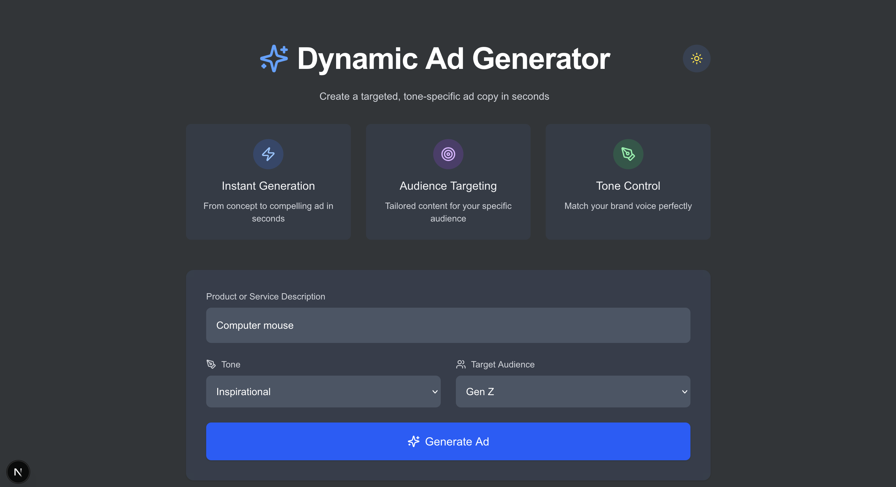
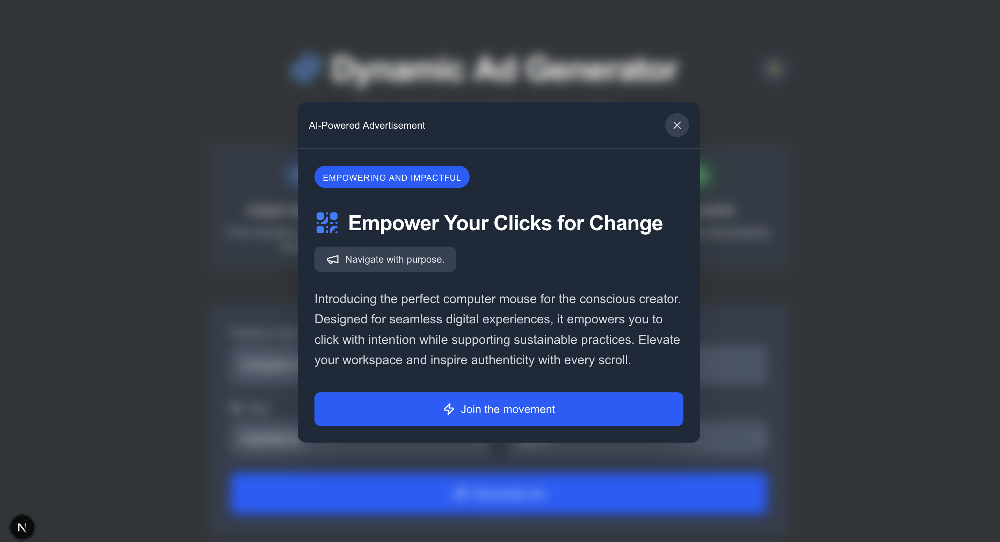

## Dynamic Ad Generator

An application that lets you create LLM-generated ads.

Website: [Demo](https://adgenerator.onrender.com)  

> Note: Please allow up to 30 seconds for the site to load - it's hosted for free. 

---

## Functionality

### 1. Enter your product description
Enter a product or service description and select the tone and target audience you'd like for the ad.

### 2. **View Advertisement**  
The system will generate an advertisement based on your input.

## Technical notes

- Built with Next.js and the OpenAI Assistants API
- Next: Adding additional media types (images and video) to the application.
